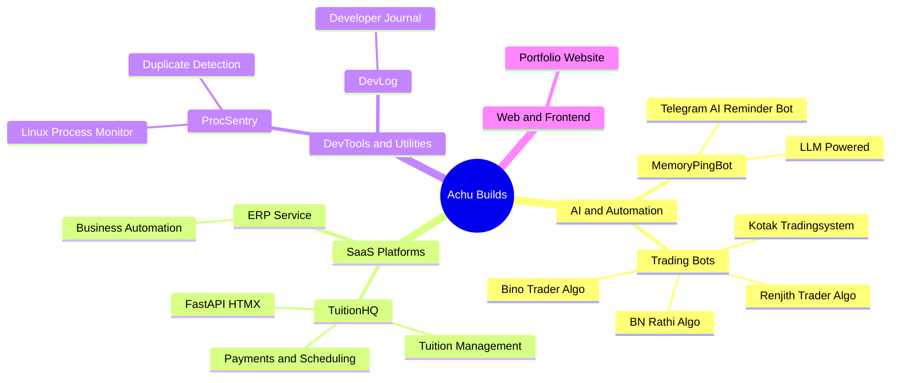
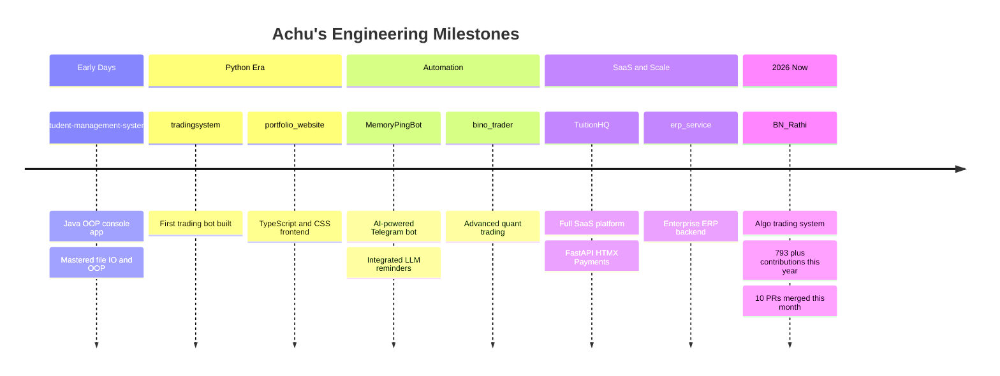

<div align="center">

<!-- Animated Header Banner -->


<!-- Animated Typing SVG -->
<a href="https://git.io/typing-svg">
  
</a>

<br/>

<!-- Profile Views + Followers -->

&nbsp;


</div>

---

<!-- About Me Section -->


###  About Me

```python
class AchuVijayakumar:
    def __init__(self):
        self.name       = "Achu Vijayakumar"
        self.role       = "Software Engineer"
        self.location   = "Thiruvananthapuram, India 🇮🇳"
        self.website    = "https://www.achuvijayakumar.online"

    def __str__(self):
        return "Building tools that actually matter ⚡"

me = AchuVijayakumar()
print(me)
# Output: Building tools that actually matter ⚡
```

<br clear="right"/>

---

##  Tech Arsenal

<div align="center">

### Languages


### Frameworks & Tools


</div>

---

##  What I Build



---

##  Featured Projects

<div align="center">

|  Project |  Description |  Stack |
|:---:|:---:|:---:|
| [**ProcSentry**](https://github.com/achuvijayakumar/ProcSentry) | Lightweight Linux process intelligence and duplicate detection | Python · Linux · SQLite |
| [**MemoryPingBot**](https://github.com/achuvijayakumar/MemoryPingBot) | AI-powered Telegram reminder bot with LLM integration | Python · Telegram API · AI |
| [**TuitionHQ**](https://github.com/achuvijayakumar/TuitionHQ) | Full SaaS for tuition management with payments and scheduling | FastAPI · HTMX · Python |
| [**erp_service**](https://github.com/achuvijayakumar/erp_service) | Business process automation and ERP backend | Python · FastAPI |
| [**BN_Rathi**](https://github.com/achuvijayakumar/BN_Rathi) | Algorithmic trading system | Python · Quant Finance |
| [**student-management-system**](https://github.com/achuvijayakumar/student-management-system) | Java console app for student records with OOP and file IO | Java · OOP |

</div>

---

##  GitHub Stats

<div align="center">


</div>

##  My Coding Journey



---

##  Connect With Me

<div align="center">

[](https://www.achuvijayakumar.online)
[](https://linkedin.com/in/achuvijayakumar)
[](mailto:achuvijayakumar98@gmail.com)
[](https://github.com/achuvijayakumar)

</div>

---

##  Watch My Contributions Get Eaten

<div align="center">

<picture>
  <source media="(prefers-color-scheme: dark)" srcset="https://raw.githubusercontent.com/achuvijayakumar/achuvijayakumar/output/github-contribution-grid-snake-dark.svg" />
  <source media="(prefers-color-scheme: light)" srcset="https://raw.githubusercontent.com/achuvijayakumar/achuvijayakumar/output/github-contribution-grid-snake.svg" />
  
</picture>

</div>

---

<div align="center">


*Thanks for visiting!*

</div>
