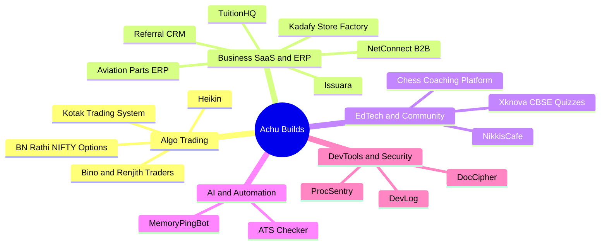
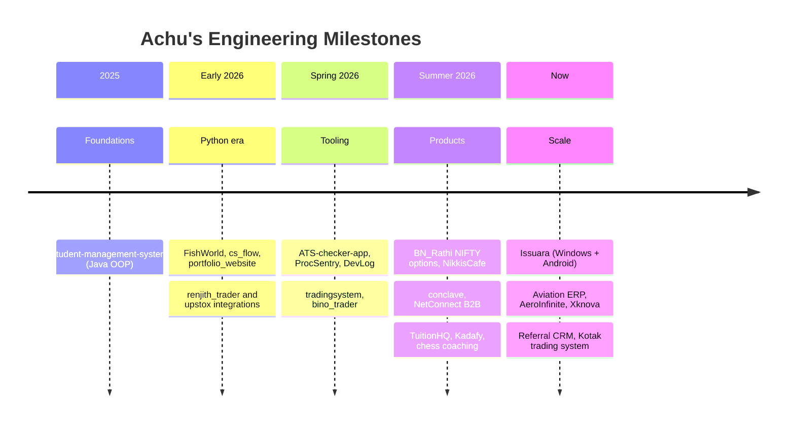

<div align="center">

<!-- Animated Header Banner -->


<!-- Animated Typing SVG -->
<a href="https://git.io/typing-svg">
  
</a>

<br/>


&nbsp;


</div>

---


### About Me

```python
class AchuVijayakumar:
    """Backend engineer who turns messy business problems into systems that just work."""

    def __init__(self):
        self.role     = "Software Engineer"
        self.based_in = "Thiruvananthapuram, India"
        self.stack    = ["Python", "FastAPI", "HTMX", "SQLite", "Linux"]
        self.domains  = ["Algo Trading", "Business SaaS & ERP", "EdTech", "Developer Tooling"]
        self.shipped  = "30+ projects: CRMs, ERPs, trading engines, desktop & Android apps"
        self.website  = "https://www.achuvijayakumar.online"

    def focus(self):
        return "Production-grade backends that scale quietly and run unattended."

    def currently(self):
        return "Building Issuara, Xknova and a live options-trading stack."


me = AchuVijayakumar()
print(me.focus())
print(me.currently())
# -> Production-grade backends that scale quietly and run unattended.
# -> Building Issuara, Xknova and a live options-trading stack.
```

<br clear="right"/>

---

## Tech Arsenal

<div align="center">

### Languages


### Backend & Data


### Frontend, Apps & Ops


</div>

---

## What I Build



---

## Featured Projects

> 🔒 = private / client repo. Happy to walk through any of them on request.

<div align="center">

### Business SaaS & ERP

| Project | Description | Stack |
|:---|:---|:---|
| **Issuara** 🔒 | Business document-pack generator for Windows & Android: enter shared details once, preview, generate versioned PDFs, works offline | Python · Desktop · Android |
| **Aviation Parts ERP** 🔒 | Production ERP for aviation parts procurement: RFQs → worker assignment → supplier sourcing → client delivery | FastAPI · HTMX · SQLite |
| **AeroInfinite** 🔒 | Aircraft parts discovery platform with full-text search | FastAPI · HTMX · SQLite FTS5 · Tailwind |
| **Referral CRM** 🔒 | Real-estate CRM driven by a referrer network, with deal pipeline and automatic commission tracking | Python · FastAPI |
| **NetConnect** 🔒 | BNI-style referral networking platform with multi-chapter organisation | FastAPI · HTMX · SQLite |
| **Kadafy** 🔒 | Local-first store factory: spins up independent FastAPI storefronts, each with its own SQLite DB | FastAPI · SQLite |
| **TuitionHQ** 🔒 | Tuition-management SaaS with payments, scheduling and automation | FastAPI · HTMX · Python |

### Algo Trading

| Project | Description | Stack |
|:---|:---|:---|
| **Kotak Trading System** 🔒 | Fully automated algo-trading platform on the Kotak Neo API with live WebSocket market data | Python · WebSockets |
| **BN_Rathi** 🔒 | Three independent NIFTY options strategies running side by side | Python · Quant Finance |
| **Bino / Renjith Trader** 🔒 | Custom strategy engines built for individual traders | Python |

### EdTech, Community & AI

| Project | Description | Stack |
|:---|:---|:---|
| **Xknova** 🔒 | CBSE practice quizzes for Classes 1–12 with instant worked explanations and progress tracking | Python · FastAPI |
| **Chess Coaching Platform** 🔒 | Real-time chess coaching with an interactive board | HTML · JS · WebSockets |
| **NikkisCafe** 🔒 | Community platform for awareness, support and empowerment | FastAPI · HTMX · Tailwind |
| **MemoryPingBot** 🔒 | Reminder bot that understands natural language: recurring reminders, streaks, delegation | Python · FastAPI · NLP/ML |

### Open Source

| Project | Description | Stack |
|:---|:---|:---|
| [**DocCipher**](https://github.com/achuvijayakumar/DocCipher) | Desktop app that removes DOCX editing and PDF usage restrictions safely (never touches the original); 97 tests, signed auto-updater | FastAPI · HTMX · PyMuPDF · PyInstaller |
| [**ProcSentry**](https://github.com/achuvijayakumar/ProcSentry) | Lightweight Linux process intelligence and duplicate detection for VPS/servers | Python · FastAPI · SQLite |
| [**DevLog**](https://github.com/achuvijayakumar/DevLog) | Zero-touch coding-session tracker with analytics dashboard | Python · SQLite · Streamlit |

</div>

---

## GitHub Stats

<div align="center">


</div>

## My Coding Journey



---

## Connect With Me

<div align="center">

[](https://www.achuvijayakumar.online)
[](https://linkedin.com/in/achuvijayakumar)
[](mailto:achuvijayakumar98@gmail.com)
[](https://github.com/achuvijayakumar)

**Open to backend roles, freelance SaaS builds and trading-system work.**

</div>

---

## Watch My Contributions Get Eaten

<div align="center">

<picture>
  <source media="(prefers-color-scheme: dark)" srcset="https://raw.githubusercontent.com/achuvijayakumar/achuvijayakumar/output/github-contribution-grid-snake-dark.svg" />
  <source media="(prefers-color-scheme: light)" srcset="https://raw.githubusercontent.com/achuvijayakumar/achuvijayakumar/output/github-contribution-grid-snake.svg" />
  
</picture>

</div>

---

<div align="center">


*Thanks for visiting!*

</div>
